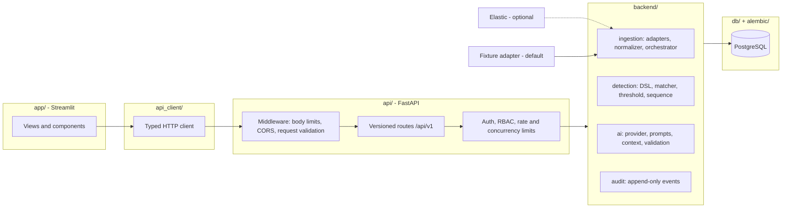

# AI SOC Copilot

A working security operations centre workflow: telemetry arrives, deterministic
detection rules fire, an analyst investigates the evidence, and an AI assistant offers
an opinion it is required to cite. Built to show how AI belongs in a SOC without being
allowed to decide anything.

Clone it and run the whole thing locally in about five minutes. No SIEM licence, no AI
vendor account, no cloud.

> **Screenshot placeholder.** Captures land in `docs/images/` with the guide in
> [docs/images/README.md](docs/images/README.md). Nothing is shown here rather than
> showing a mock-up.

## Why it exists

Most AI-for-security demos put a language model in the decision path and hope. This one
inverts that. Detections are deterministic and reproducible. Evidence has stable
identifiers. The AI receives a bounded context assembled from the database, and its
output is rejected if it cites anything it was not given. Authorization is enforced in
the service layer, and every state change lands in an append-only audit log.

The interesting part is not that an AI summarises an alert. It is everything that
constrains it.

## Architecture



Four rules keep the layers apart. `app/` renders and never parses or validates. `api/`
speaks HTTP and never holds business logic. `backend/` holds the workflows. `db/` owns
persistence, and both the application and Alembic build their connection from the same
setting, so migrations cannot drift from the code.

More detail in [docs/architecture.md](docs/architecture.md).

## What works

**Telemetry ingestion.** Provider-neutral adapters normalise source records into
canonical events. Elastic is the real provider; an in-memory fixture adapter is the
default so the demo needs no external service. Syncs are bounded, restartable through
checkpoints, and idempotent on replay.

**Detection engine.** A structured rule DSL with matcher, threshold, and sequence
evaluators. Execution is deterministic, uses event time rather than arrival time,
scans a bounded number of events, and records a durable run before evaluating. Alert
fingerprints make replay a no-op.

**Analyst workflow.** Dashboard, investigations, alert detail with linked evidence and
MITRE ATT&CK mapping, escalation to cases, case activity timelines, notes, status and
priority, and detection rule management. All persisted through PostgreSQL.

**Advisory AI.** Alert triage, case-scoped question answering, and report drafting.
Each one assembles evidence from the database, sends it as explicitly untrusted data,
validates the response against a versioned schema, and rejects any citation outside the
supplied context.

**Security.** Local authentication with opaque bearer sessions, server-enforced RBAC
across four roles, append-only audit events, request and concurrency limits on the
expensive paths, and secret redaction throughout.

Not everything is wired. MITRE Explorer, Threat Intelligence, Analyze Alert, and
Settings are prototypes on static data. Dashboard, Investigations, and Integrations are
API-backed but each keeps one static panel. Reports is a hybrid: its metrics and preview
are static, while the report-drafting button calls the real API. And the Copilot panel
in the sidebar, which renders on every page, is a prototype that returns a canned reply;
the real case-scoped Q&A lives on the case detail view.

## Stack

| Layer | Choice |
|---|---|
| Language | Python 3.12 in CI, also runs on 3.14 |
| Frontend | Streamlit 1.63 |
| API | FastAPI 0.141, Uvicorn, Pydantic 2 |
| Persistence | PostgreSQL 16, SQLAlchemy 2.0, Alembic |
| Auth | argon2 password hashing, opaque bearer sessions |
| Telemetry | Elasticsearch client 8.19, plus an in-memory fixture adapter |
| Tests | pytest, Streamlit AppTest |

## Quick start

Requires Docker and Python 3.12 or newer.

```bash
python -m venv .venv && source .venv/bin/activate
python -m pip install -r requirements.txt
cp .env.example .env
make setup
```

`make setup` starts PostgreSQL and waits for its health check, applies migrations,
loads the deterministic demo dataset, and creates a demo Admin. It is idempotent, so
running it again changes nothing. The order matters and the target enforces it.

The admin bootstrap prints a generated password once. Export it:

```bash
export DEMO_PASSWORD='the password make setup printed'
```

Then start the two processes, in separate terminals:

```bash
make api    # FastAPI on :8000
make ui     # Streamlit on :8501
```

Check everything in one command:

```bash
make smoke
```

```
PASS  database            Reachable.
PASS  migrations          At head (e1f2a3b4c5d6).
PASS  seed_data           ALERT-0005 present, 5 rules.
PASS  api_health          Liveness OK.
PASS  api_ready           Readiness OK.
PASS  authenticated_read  'demo-admin' can read alerts.
```

`make` with no target lists everything. Every target is a thin wrapper around a single
command, so you can always run the command directly instead.

Two notes. If a system PostgreSQL already owns port 5432, set `POSTGRES_PORT` in `.env`
to something free before `make setup`; the application, Alembic, and Compose all follow
it. And the demo account is an Admin on purpose, because the full workflow spans four
permissions and no lesser role holds all of them.

## The demo

Follow [docs/demo.md](docs/demo.md). It walks one intrusion from raw telemetry to a
documented case: SSH brute force, valid login, privilege escalation via `sudo`, and
persistence written to `authorized_keys`.

You open `ALERT-0005`, read its three linked evidence rows, check the MITRE mapping
(T1098.004, Persistence), run AI triage and inspect what it cited, escalate to
`CASE-2026-0004`, work the case, ask the Copilot a question, draft the report, read the
audit trail, then restart both processes and watch all of it survive.

Every identifier in that document is deterministic. The seed derives every timestamp
from a fixed constant, so a clean database produces exactly those records.

## Design decisions

**Deterministic seed data.** Every timestamp derives from one constant and every row is
looked up by a natural key before insert. Re-seeding is safe, and documentation can
name specific records without going stale.

**The AI fails closed and cites its sources.** `AI_ENABLED=false` returns "unavailable"
rather than degrading quietly. Output that cites evidence outside the supplied context
is rejected before it is persisted. Evidence is labelled untrusted data in the prompt,
because event content is attacker-controlled.

**Authorization is server-side.** The permission matrix lives in one module and is
enforced by FastAPI dependencies and inside privileged services. Streamlit uses the
same matrix to hide unavailable actions, which is a usability aid and not a security
boundary.

**Audit is append-only.** Security-relevant mutations are recorded with an actor,
including failures and denials, so a rejected action leaves a trace.

**A typed client between Streamlit and FastAPI.** `api_client/` reuses the API's own
Pydantic schemas, so the frontend and backend cannot drift. It imports no Streamlit, so
it is testable on its own.

**Event time, not arrival time.** Detection windows use `events.timestamp`. A
late-arriving event never lands in the wrong window.

## Testing and CI

```bash
make test          # or: pytest
```

The suite covers API endpoints, ORM and database constraints, seed idempotency, the
typed client, detection evaluators, AI schema validation and prompt-injection handling,
RBAC denials, audit records, and the Streamlit pages through AppTest.

GitHub Actions runs on every pull request against a real PostgreSQL 16 service:
compile check, clean migration, a downgrade and re-upgrade, `alembic check` for
migration drift, then the full suite. Two more jobs run `pip-audit` against the pinned
dependencies and a gitleaks scan over the full history.

Details in [docs/ci.md](docs/ci.md).

## Security and AI safety

- [docs/threat-model.md](docs/threat-model.md) — assets, actors, trust boundaries, threats, and accepted risks
- [docs/permissions.md](docs/permissions.md) — the role and permission matrix
- [docs/api-security.md](docs/api-security.md) — request boundaries and abuse controls
- [docs/ai-safety.md](docs/ai-safety.md) — what the AI receives, what it may cite, and what it cannot do
- [SECURITY.md](SECURITY.md) — how to report a vulnerability

## Limitations

This is a portfolio project. It is honest about what that means.

**No AI vendor is wired up.** The provider abstraction, prompt construction, evidence
context, schema validation, and abuse controls are all real and tested. The only
implemented provider is a deterministic offline fake. Setting `AI_PROVIDER` to a vendor
name does not reach that vendor; it falls back to unavailable.

**Single-node, single-tenant, local.** No horizontal scaling, no multi-tenancy, no
secret manager, no TLS termination, no managed backups. Authentication is local
accounts only.

**Detection runs on demand.** There is no scheduler. Rules execute when you ask them to.

**The Elastic path is less exercised than the fixture path**, because the default demo
deliberately avoids requiring a cluster.

**Five screens are still prototypes** on static data, as listed above.

Known gaps and their priority are tracked in
[docs/release-readiness.md](docs/release-readiness.md).

## Roadmap

- Wire a real AI vendor behind the existing provider abstraction
- Schedule detection execution instead of running it on demand
- Replace the remaining prototype screens with live data
- Broaden ingestion beyond Elastic and fixtures

## Development

Setup, migrations, conventions, and how to run test subsets are in
[docs/development.md](docs/development.md). Deeper references:
[ingestion](docs/ingestion.md), [detections](docs/detections.md),
[operations runbook](docs/operations-runbook.md),
[reliability inventory](docs/reliability-inventory.md).

## Licence

MIT. See [LICENSE](LICENSE).
