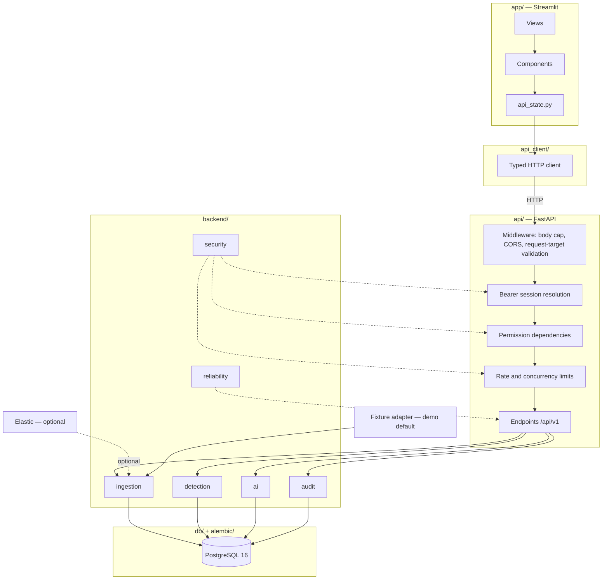

# Architecture

**Audience:** anyone who needs to know where a change belongs.

Current as of Phase 6. For the request-by-request security rules see
[docs/api-security.md](api-security.md); for the trust boundaries see
[docs/threat-model.md](threat-model.md).

## Shape



## Layers

| Path | Responsibility | Must not contain |
|---|---|---|
| `app/` | Page rendering and shared components | Parsing, validation, business logic |
| `api_client/` | Typed HTTP client for the SOC API | Any Streamlit import |
| `api/` | HTTP surface, versioned at `/api/v1` | Business logic |
| `api/schemas/` | Request and response DTOs | ORM models or view models |
| `backend/` | Business workflows | HTTP or UI concerns |
| `db/` | ORM models, session factory, `get_db`, seed, bootstrap | View models or HTTP DTOs |
| `alembic/` | Migrations generated from `db/models` metadata | Hand-written drift |
| `config/` | Configuration loaded once and validated | Scattered `os.getenv` reads |
| `scripts/` | Operator helpers | Capability the API lacks |

Three model layers exist and are not interchangeable: SQLAlchemy ORM in `db/models/`,
HTTP DTOs in `api/schemas/`, and typed service contracts in `backend/models/`.
`api_client/` reuses `api/schemas` directly so the frontend and backend cannot drift.

## Request path

A Streamlit action calls `api_client/` through `app/components/api_state.py`, the only
module allowed to bridge the two. The request crosses HTTP and passes, in order:

1. **Middleware.** Body size is capped by `API_MAX_BODY_BYTES` while the request is
   still being received, before FastAPI or Pydantic buffers it. Request targets with
   duplicate query keys, decoded traversal segments, backslashes, or control
   characters are rejected. CORS allows only the configured origins.
2. **Authentication.** Every route except login and liveness requires an opaque bearer
   session. PostgreSQL stores only a SHA-256 digest of the token.
3. **Authorization.** A permission dependency consults the single matrix in
   `backend/security/rbac.py` before resource lookup, so a denial leaks nothing about
   whether the resource exists.
4. **Abuse control.** Login, AI, ingestion, and detection paths carry per-window rate
   limits and concurrency caps.
5. **Endpoint,** which delegates to `backend/` and returns a schema.

Streamlit uses the same permission matrix to hide unavailable actions. That is a
usability aid, not a security boundary.

## Persistence

PostgreSQL is the system of record. `db/session.py` and `alembic/env.py` both build
their URL from `config.settings.AppConfig.database_url`, so application code and
migrations cannot target different databases.

```bash
docker compose up -d --wait
alembic upgrade head
alembic downgrade -1
```

## Ingestion

Provider-neutral. Adapters return `SourceRecord` values, the normalizer maps common ECS
fields onto canonical `Event` columns while preserving the raw payload, and the
orchestrator persists events with run and checkpoint state. Checkpoints advance only
after a successful commit, so a sync is restartable and idempotent.

Elastic is the real provider and is optional. The in-memory fixture adapter is the demo
default and needs no external service. See [docs/ingestion.md](ingestion.md).

## Detection

Deterministic and data-only. A structured DSL is parsed by `backend/detection/dsl.py`
and evaluated by single-event, threshold, or sequence evaluators. Execution uses
`events.timestamp` as the canonical event time, scans a bounded candidate set, writes a
durable run header before evaluating, and creates alerts carrying a unique fingerprint,
rule version, and a snapshot of the logic that fired. Replay is a no-op.

No language model participates. See [docs/detections.md](detections.md) and
[docs/detection-schema.md](detection-schema.md).

## AI

Advisory and isolated. `backend/ai/context.py` assembles a bounded evidence context
from the database, `prompts.py` builds a request that labels that evidence as untrusted
data, and the provider returns text validated against a versioned schema. Citations
outside the supplied context are rejected.

The provider receives an `AIRequest` and nothing else: no database session, no HTTP
client, no filesystem, no tools. An AI failure cannot break a deterministic workflow.
See [docs/ai-safety.md](ai-safety.md).

## Cross-cutting

**Audit.** `backend/audit/` records security-relevant mutations with an actor into an
append-only table, including failures and denials, with secrets redacted.

**Reliability.** `backend/reliability/idempotency.py` supports actor-scoped idempotency
keys. Case-number allocation uses a PostgreSQL advisory lock. Domain rows, timeline
rows, and audit events commit together. See
[docs/reliability-inventory.md](reliability-inventory.md).

**Health.** `/api/v1/health` reports process liveness without touching the database.
`/api/v1/ready` verifies database connectivity and returns 503 when it fails, so a
dependency outage is distinguishable from a dead process.

**Logging.** Structured JSON to `logs/app.log`. Credentials, tokens, and raw payload
values are never logged.

## Principles

- Configuration loads once at startup and is injected, never read ad hoc.
- Services compose validators and parsers rather than duplicating them.
- Authorization is server-side; UI visibility is a convenience.
- External evidence is untrusted data.
- External dependency failures are bounded and isolated.

## Related

- [docs/development.md](development.md) — working in this codebase
- [docs/api-security.md](api-security.md) — request boundaries and abuse controls
- [docs/permissions.md](permissions.md) — the role matrix
- [docs/threat-model.md](threat-model.md) — assets, threats, accepted risks
- [docs/operations-runbook.md](operations-runbook.md) — startup, recovery, reset
- [docs/ci.md](ci.md) — what runs on every pull request
